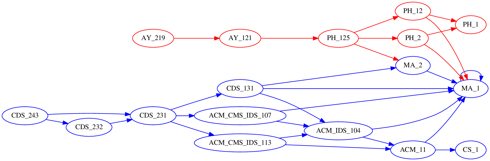
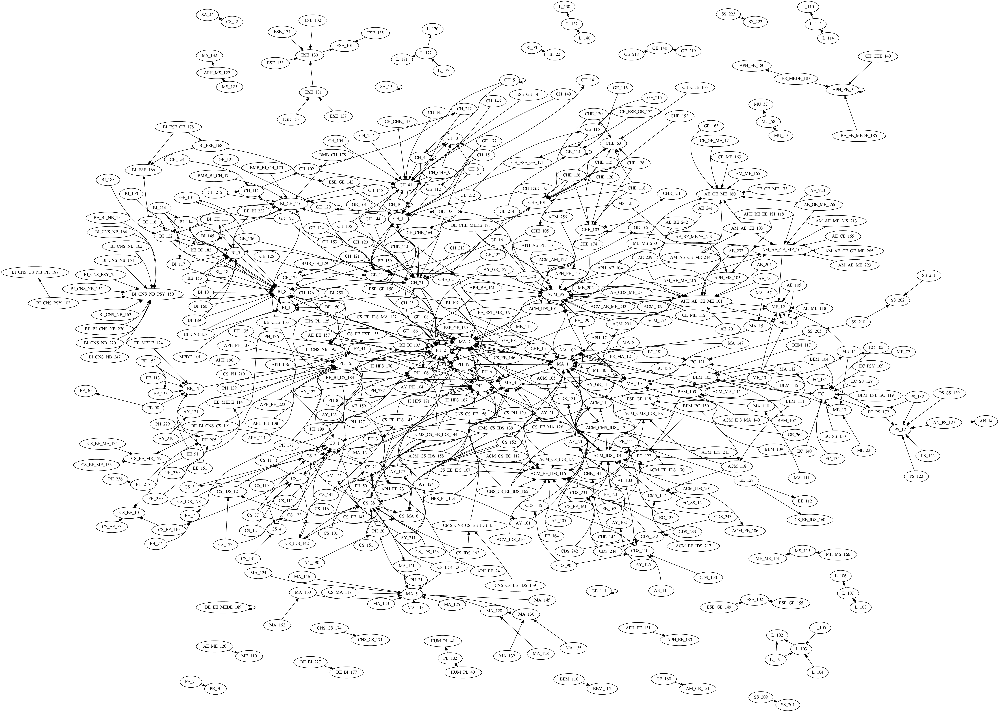

# Caltech Class Trees

Creates rendering of class prerequisites at Caltech, like those below.
Make your own at [the hosted version](https://caltech-catalog.lyt.gs/trees).

## Compromises and Innaccuracies

- Any specifying language like optional prerequisites, interchangable prerequisites, or specific course letters (part abc etc) are ignored
- Parts abc are all treated as the same course
- Manual tweaking is required after web scraping and in the process of resolving prerequisites

The Caltech catalog is generally quite annoying:

- There are prerequisites that don't exist.
- There's a single course with multiple numbers.
- There's cross-listings with overlapping numbers (does "ACM/GE 118" refer to ACM 118 or ESE/GE 118?).
- Departments are alphabetical until they aren't.

I would not recommend trying to do anything with it programmatically, as I have foolishly attempted to do here.

## Code Quality

It's for playing around, not for anything serious. The output is to make you go "huh," not to put behind nginx.
