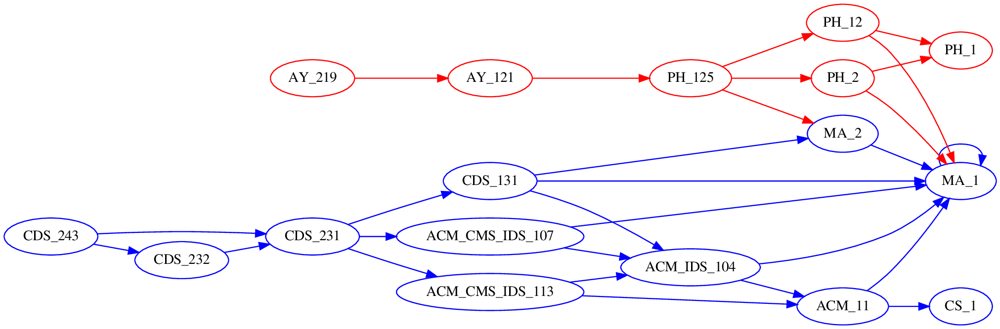
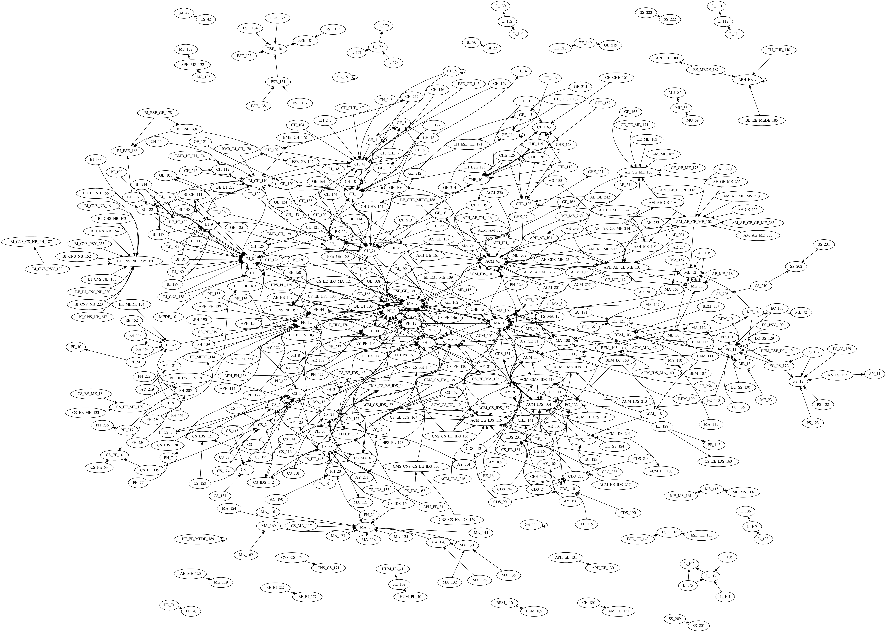

# Caltech Class Trees

Creates rendering of class prerequisites at Caltech, like these:

## Compromises and innaccuracies

- Any specifying language like optional prerequisites, interchangable prerequisites, or specific course letters (part abc etc) are ignored
- Parts abc are all treated as the same course
- Manual tweaking is required after web scraping and in the process of resolving prerequisites
